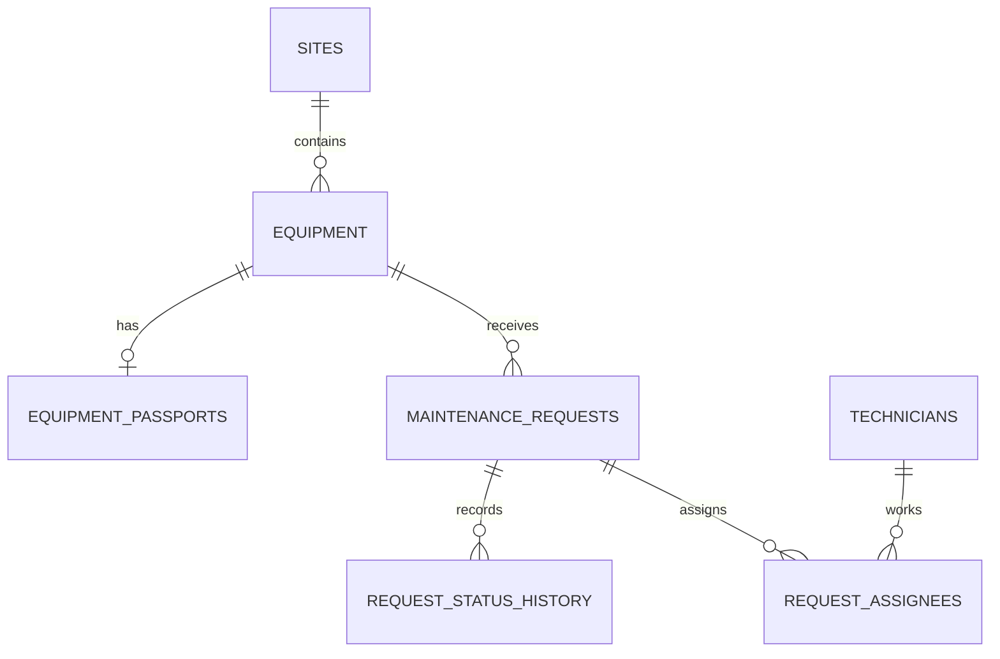

# CaseLab Maintenance API

REST API на Express/TypeScript для учёта оборудования производственной площадки и
заявок на техническое обслуживание. Оборудование и заявки хранятся в PostgreSQL
через Sequelize; схема управляется миграциями, связанные данные загружаются
через ассоциации моделей. Эндпоинт прогноза использует координаты площадки и
Open-Meteo.

## Требования

- Node.js 20+
- npm 10+

## Установка и запуск

```bash
npm install
copy .env.example .env
docker compose up -d db
npm run db:migrate
npm run db:seed:all
npm run dev
```

Миграции и сиды создаются в `db/migrations` и `db/seeders`. До добавления
соответствующих файлов команды миграции/сидирования не создают прикладную схему
и не наполняют базу. Так как пакет использует ESM, файлы CLI миграций и сидов
должны быть CommonJS-файлами `.cjs` (сгенерированный CLI `.js` нужно переименовать).
Сервер дожидается доступности PostgreSQL перед запуском;
`GET /api/health` проверяет подключение через Sequelize.

Для production:

```bash
npm run build
npm start
```

Проверка доступности: `GET http://localhost:3000/api/health`.
Коллекция Postman находится в
[`docs/postman/caselab-api.postman_collection.json`](./docs/postman/caselab-api.postman_collection.json).

## Переменные окружения

| Переменная | По умолчанию | Назначение |
|---|---:|---|
| `NODE_ENV` | - | `production` скрывает детали внутренних ошибок |
| `PORT` | `3000` | Порт HTTP-сервера |
| `CORS_ORIGINS` | `http://localhost:5173` | Разрешённые origins через запятую |
| `RATE_LIMIT_WINDOW_MS` | `900000` | Окно rate limit, мс |
| `RATE_LIMIT_MAX` | `100` | Максимум запросов `/api` за окно с одного IP |
| `JSON_BODY_LIMIT` | `2mb` | Максимальный JSON body |
| `URL_ENCODED_BODY_LIMIT` | `10kb` | Максимальный URL-encoded body |
| `WEATHER_API_URL` | Open-Meteo | URL внешнего погодного API |
| `REQUEST_TIMEOUT_MS` | `5000` | Таймаут запроса к погодному API |
| `WEATHER_FORECAST_DAYS` | `3` | Количество дней прогноза |
| `WEATHER_MAX_PRECIPITATION` | `1` | Допустимые осадки |
| `WEATHER_MAX_WIND_SPEED_KMH` | `30` | Допустимая скорость ветра, км/ч |
| `POSTGRES_DB` | `appdb` | Имя базы для инициализации контейнера Compose |
| `POSTGRES_USER` | `app` | Пользователь для инициализации контейнера Compose |
| `POSTGRES_PASSWORD` | - | Пароль для инициализации контейнера Compose |
| `PGHOST` | `localhost` | Хост PostgreSQL для приложения и Sequelize CLI |
| `PGPORT` | `5432` | Порт PostgreSQL |
| `PGDATABASE` | - | Имя базы данных приложения |
| `PGUSER` | - | Пользователь PostgreSQL приложения |
| `PGPASSWORD` | - | Пароль PostgreSQL приложения |
| `PG_POOL_MAX` | `10` | Максимальный размер пула Sequelize |
| `PG_POOL_MIN` | `0` | Минимальный размер пула Sequelize |
| `PG_POOL_ACQUIRE_MS` | `30000` | Таймаут получения соединения из пула |
| `PG_POOL_IDLE_MS` | `10000` | Время простоя соединения до закрытия |

Для отката последней миграции используйте `npm run db:migrate:undo`, всех
миграций - `npm run db:migrate:undo:all`. Команды `db:seed:all` и
`db:seed:undo:all` применяют и отменяют сиды. Данные подключения задаются через
`.env`; файл `.env` не следует добавлять в репозиторий.

## Эндпоинты

Все пути ниже начинаются с `/api`.

| Метод | Путь | Назначение |
|---|---|---|
| GET | `/health` | Проверка сервиса |
| GET | `/equipment` | Список оборудования: фильтры, сортировка, пагинация |
| POST | `/equipment` | Создание оборудования |
| GET | `/equipment/:id` | Получение оборудования |
| PATCH | `/equipment/:id` | Частичное обновление |
| DELETE | `/equipment/:id` | Удаление; запрещено при открытых заявках |
| GET | `/equipment/:id/requests` | Заявки оборудования |
| GET | `/equipment/:id/weather` | Прогноз и пригодность для наружных работ |
| GET | `/requests` | Список заявок: фильтры, сортировка, пагинация |
| POST | `/requests` | Создание заявки |
| GET | `/requests/:id` | Получение заявки |
| PATCH | `/requests/:id` | Редактирование заявки |
| PATCH | `/requests/:id/status` | Смена статуса |
| POST | `/requests/:id/assignees` | Атомарная замена бригады |
| DELETE | `/requests/:id/assignees/:userId` | Снятие специалиста с заявки |
| GET | `/requests/:id/history` | История статусов |
| DELETE | `/requests/:id` | Удаление заявки |
| GET | `/sites/:id/summary` | Сводка по площадке |
| GET | `/reports/equipment-load` | SQL-отчёт по нагрузке оборудования |

У списков доступны `page`, `limit` (до 100), `sortBy`, `sortOrder`, а также
ресурсные фильтры: `status`, `type`, `priority`, `equipmentId` и диапазоны дат.
Вложенный список `/equipment/:id/requests` поддерживает те же фильтры и
пагинацию и возвращает `meta`. Фильтры, сортировка, подсчёт и пагинация
выполняются запросами к PostgreSQL; `offset` ограничен значением 1 000 000.

**Изменение входного контракта оборудования:** `POST /equipment` теперь
требует `siteId`; координаты берутся из связанной площадки. Поле `location`
сохраняется в ответе карточки, но не принимается на запись. `PATCH /equipment`
принимает `siteId` для смены площадки. Получить существующий `siteId` можно
из списка/карточки оборудования или из таблицы `sites`.

## Модель данных

Схема PostgreSQL создаётся только миграциями в `db/migrations`; Sequelize
`sync` для создания или пересоздания таблиц не используется. Модели с
декораторами `sequelize-typescript` и ассоциациями находятся в
`src/models/entities`.



Справочные атрибуты площадки, оборудования, паспорта и специалиста хранятся в
отдельных таблицах; связь заявки со специалистом содержит только атрибуты
назначения (`role`, `hours`). Это сохраняет третью нормальную форму. Серийный
номер оборудования, код площадки, табельный номер специалиста и пара
«заявка-специалист» уникальны. У паспорта уникален `equipment_id`, что
обеспечивает связь 1:1. Ограничения БД проверяют допустимые статусы, типы,
приоритеты, роли, диапазоны координат и положительность плановых часов.

Правила внешних ключей защищают связанные данные: площадку нельзя удалить,
пока к ней привязано оборудование; оборудование нельзя удалить, пока на него
ссылаются заявки (в том числе закрытые); удаление оборудования удаляет его
паспорт. Заявку с записями журнала статусов удалить нельзя, сами записи журнала
защищены PostgreSQL-триггером от `UPDATE` и `DELETE`. Назначения удаляются
вместе с заявкой, а специалиста нельзя удалить, пока он назначен на заявку.
Частичный уникальный индекс допускает не более одного `lead` в бригаде; ровно
один ведущий проверяется в транзакции операции назначения.

**Equipment**

```json
{
  "id": "uuid",
  "siteId": "uuid",
  "name": "North Wind Turbine",
  "type": "turbine",
  "serialNumber": "WT-001",
  "location": { "lat": 55.75, "lon": 37.62 },
  "status": "operational",
  "installedAt": "2024-01-15T10:00:00.000Z",
  "passport": {
    "manufacturer": "Vestas",
    "model": "V150",
    "ratedPowerKw": 4200,
    "lastCalibrationAt": "2025-01-10"
  }
}
```

В теле `POST /equipment` и `PATCH /equipment` используйте `siteId`, а не
`location`; объект `location` в ответе формируется из координат площадки.

`type`: `turbine | inverter | sensor | substation`.
`status`: `operational | maintenance | fault | decommissioned`. Имя содержит
3–100 символов, serial number уникален, координаты находятся в пределах
широты/долготы, `installedAt` не может быть датой будущего.

**Maintenance request**

```json
{
  "id": "uuid",
  "equipmentId": "uuid",
  "title": "Inspect turbine bearings",
  "description": "Check vibration and lubrication.",
  "priority": "high",
  "status": "new",
  "plannedAt": "2030-06-15T09:00:00.000Z",
  "createdAt": "2026-09-22T05:00:00.000Z",
  "updatedAt": "2026-09-22T05:00:00.000Z",
  "author": "system",
  "assignees": []
}
```

`title`: 5–120 символов, `description`: до 2000 символов.
`priority`: `low | medium | high | critical`.

Схема переходов статуса:

```text
new -> in_progress -> done
new -> rejected
in_progress -> rejected
```

Переходы из `done` и `rejected` запрещены и возвращают `409 Conflict`.

Смена статуса блокирует строку заявки и в одной транзакции обновляет статус
и добавляет запись в append-only журнал. `PATCH /requests/:id/status` принимает
`status`; необязательные `changedBy` (до 120 символов) и `comment` (до 2000)
записываются как автор/комментарий истории. Без `changedBy` используется
`system`. Переход в `in_progress` без хотя бы одного назначенного специалиста
отклоняется с `409`.

`POST /requests/:id/assignees` заменяет все назначения одной транзакцией и
принимает:

```json
{
  "assignees": [
    { "technicianId": "uuid", "role": "lead", "hours": 4 },
    { "technicianId": "uuid", "role": "member", "hours": 2.5 }
  ]
}
```

Нужен ровно один `lead`: отсутствие или несколько ведущих дают `422`.
Несуществующий специалист - `404`, повтор одного специалиста в списке - `409`.
При ошибке прежняя бригада сохраняется. `DELETE /requests/:id/assignees/:userId`
возвращает `204`; ведущего нельзя снять, пока в бригаде остаются другие
специалисты (ответ `422`). И замена, и снятие блокируют строку заявки, чтобы
не конфликтовать со сменой статуса или параллельным редактированием бригады.

`GET /requests/:id/history` возвращает записи от старых к новым. Создание
заявки атомарно создаёт первую запись `null -> new`. Из-за правила append-only
запрос с историей нельзя физически удалить: `DELETE /requests/:id` вернёт
`409 Conflict`, не удаляя журнал.

`GET /sites/:id/summary` возвращает `requestCountsByStatus`,
`requestCountsByPriority` (включая нулевые значения для всех вариантов) и
`averageClosureHours`, вычисляемый по закрытым (`done` или `rejected`) заявкам
как среднее время от создания до соответствующей терминальной записи в журнале
статусов. Для площадки без закрытых заявок среднее равно `null`.

`GET /reports/equipment-load` принимает необязательные `from` и `to` (ISO
datetime, фильтр по `created_at` заявок) и `minRequests` (целое число от 0 до
100000, по умолчанию 0). Группировка выполняется PostgreSQL; значения передаются
параметрами bind. В `data` для каждой подходящей единицы оборудования есть число
заявок, число закрытых (`done` или `rejected`), сумма плановых часов всех
назначений и время последнего перехода в `done` (`lastMaintenanceAt`, `null`
если закрытых заявок нет).

`npm run db:seed:all` добавляет демонстрационные данные: 2 площадки,
6 единиц оборудования с паспортами, 20 заявок в разных статусах и 5
специалистов с назначениями и историей статусов. `npm run db:seed:undo:all`
удаляет только этот набор данных.

## Формат ошибок

```json
{
  "error": {
    "code": "VALIDATION_ERROR",
    "message": "Некорректные данные запроса",
    "details": [
      { "field": "name", "message": "Имя должно содержать минимум 3 символа" }
    ],
    "requestId": "req-uuid"
  }
}
```

Основные коды: `400` - ошибка валидации, `404` - ресурс не найден,
`409` - конфликт, `422` - бизнес-правило бригады не выполнено,
`429` - превышен лимит, `502` - недоступен погодный сервис, `500` - внутренняя
ошибка. В development добавляется `stack`; в production детали внутренних
ошибок не раскрываются.

## Примеры

Создание оборудования:

```bash
curl -X POST http://localhost:3000/api/equipment \
  -H "Content-Type: application/json" \
  -d '{"siteId":"10000000-0000-4000-8000-000000000001","name":"North Wind Turbine","type":"turbine","serialNumber":"WT-001","status":"operational","installedAt":"2024-01-15T10:00:00.000Z"}'
```

Ответ `201`:

```json
{ "success": true, "data": { "id": "generated-uuid", "siteId": "10000000-0000-4000-8000-000000000001", "name": "North Wind Turbine", "type": "turbine", "serialNumber": "WT-001", "location": { "lat": 56.123456, "lon": 37.654321 }, "status": "operational", "installedAt": "2024-01-15T00:00:00.000Z", "passport": null } }
```

Создание заявки:

```bash
curl -X POST http://localhost:3000/api/requests \
  -H "Content-Type: application/json" \
  -d '{"equipmentId":"<equipment-id>","title":"Inspect turbine bearings","priority":"high"}'
```

Ошибочные примеры:

```bash
curl http://localhost:3000/api/equipment/00000000-0000-4000-8000-000000000000
# 404: { "error": { "code": "NOT_FOUND", "message": "Equipment not found", "details": [], "requestId": "..." } }

curl -X POST http://localhost:3000/api/equipment \
  -H "Content-Type: application/json" -d '{"siteId":"00000000-0000-4000-8000-000000000000","name":"x"}'
# 400: error.code = "VALIDATION_ERROR"

curl -X PATCH http://localhost:3000/api/requests/<done-request-id>/status \
  -H "Content-Type: application/json" -d '{"status":"rejected"}'
# 409: error.code = "CONFLICT"
```

## Безопасность

- CORS разрешает только origins из `CORS_ORIGINS`.
- Для всех `/api` включён rate limit: по умолчанию 100 запросов за 15 минут
  с одного IP; при превышении возвращается `429` и `RateLimit-*` headers.
- `helmet` устанавливает защитные заголовки, включая HSTS и запрет
  встраивания во frame.
- Размеры JSON и URL-encoded тела ограничены соответствующими переменными.
- `requestId` возвращается в ошибке и записывается в логах для диагностики.

## Структура проекта

```text
src/
  config/          конфигурация окружения
  controllers/     обработчики HTTP
  routes/          маршруты API
  schemas/         Zod-схемы валидации
  services/        бизнес-правила и интеграция с погодой
  repositories/    слой хранения данных
  models/          типы доменных моделей
  middleware/      CORS, rate limit, логирование, ошибки
  errors/          классы ошибок
docs/postman/      коллекция Postman
```
